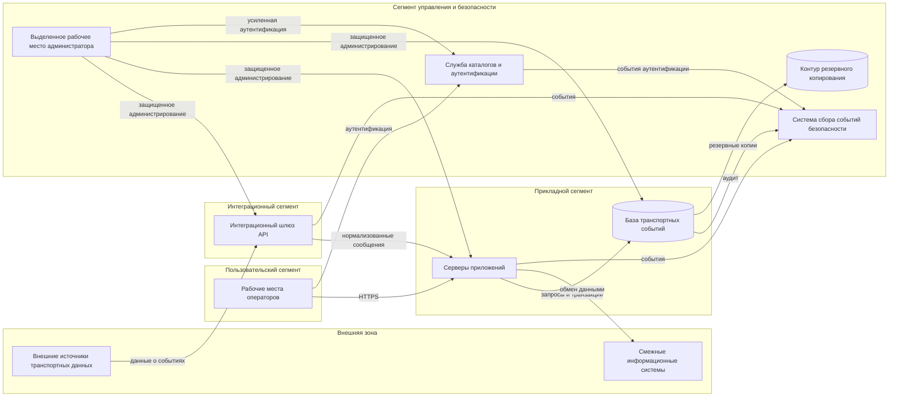

# Архитектура и границы доверия

## 1. Назначение схемы

Схема используется для определения объектов воздействия, точек входа, межсегментных взаимодействий и возможных переходов нарушителя между компонентами системы.

## 2. Границы доверия

### Граница G-01. Внешние взаимодействия

Пересекается при получении данных от внешних источников и передаче сведений смежным системам. Основные риски: подмена отправителя, изменение сообщения, повторная передача ранее принятого сообщения, перегрузка интерфейса и эксплуатация ошибок обработки входных данных.

### Граница G-02. Пользовательский доступ

Отделяет рабочие места операторов от прикладного сегмента. Основные риски: компрометация учетной записи, заражение рабочей станции, превышение полномочий и несанкционированный экспорт сведений.

### Граница G-03. Административный доступ

Отделяет сегмент управления от прикладных компонентов. Администрирование допускается только с выделенного рабочего места через контролируемые сетевые взаимодействия. Основные риски: использование общей учетной записи, перехват административной сессии и изменение конфигурации вне установленной процедуры.

### Граница G-04. Доступ к данным

Отделяет серверы приложений и административные средства от базы данных. Основные риски: использование избыточных прав сервисной учетной записи, выполнение несанкционированных запросов и отключение аудита.

### Граница G-05. Передача событий безопасности

Отделяет источники событий от системы централизованного анализа. Основные риски: потеря части событий, изменение журналов до отправки и рассинхронизация времени.

## 3. Допущения

1. Прямой доступ операторов к базе данных отсутствует.
2. Внешние источники не считаются доверенными только на основании сетевого адреса.
3. Административные интерфейсы не публикуются в сети общего пользования.
4. Контур резервного копирования отделен от прикладного сегмента и использует отдельные учетные данные.
5. Система сбора событий безопасности не используется как единственное место хранения первичных журналов.

## 4. Точки входа

| Код | Точка входа | Доступ | Связанные угрозы |
|---|---|---|---|
| EP-01 | Публичный API приема данных | внешний | T-02, T-03, T-08 |
| EP-02 | Веб-интерфейс оператора | пользовательский | T-01, T-12, T-16 |
| EP-03 | Интерфейс администрирования | привилегированный | T-04, T-09, T-14 |
| EP-04 | Канал обновления ПО | технологический | T-05, T-15 |
| EP-05 | Интерфейс базы данных | сервисный и административный | T-10, T-11 |
| EP-06 | Канал передачи журналов | технологический | T-07, T-18 |
